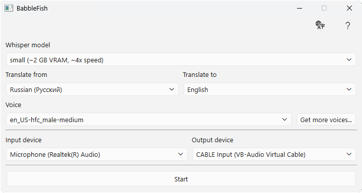

# BabbleFish

BabbleFish is a real-time speech translation program. It captures audio from a microphone, converts speech to text, translates it into a selected language, and plays back the translated result using text-to-speech.



# How BabbleFish Works

BabbleFish processes audio in three sequential stages: speech recognition, translation, and speech synthesis.

## 1. Speech Recognition

The program uses OpenAI's Whisper models to convert spoken language into text.

Before starting, you need to select a Whisper model.

Smaller models are faster and require less VRAM, but may be less accurate. They are suitable for real-time use on low-end hardware.

Larger models provide significantly better accuracy, especially in noisy environments or with strong accents, but require more GPU memory and run more slowly.

## 2. Text Translation

Once speech is transcribed, the text is automatically translated into the target language.

You must configure:

* the source language
* the target language

## 3. Speech Synthesis

The translated text is converted back into speech and played through the selected audio output device.

To use speech synthesis, you must install voice models first. This can be done using the "Get more voices…" option in the program.

# Using BabbleFish in Voice Chats

BabbleFish does not automatically create a virtual microphone.

To use translated audio in calls, streams, or recordings, you need a virtual audio cable or similar tool.

A common solution is VB-Audio Cable: [https://vb-audio.com/Cable/](https://vb-audio.com/Cable/)

## Setup Instructions

1. Set your physical microphone as the input device in BabbleFish.
2. Select **VB-CABLE Input** as the output device in BabbleFish.
3. In your communication app (Discord, Zoom, OBS, games, etc.), select **VB-CABLE Output** as the microphone input.

After this setup, others will hear the translated and synthesized speech instead of your original voice.

# Installation

## Windows

Download and run the latest executable from the releases page:
[https://github.com/nar1nari/babblefish/releases/latest/](https://github.com/nar1nari/babblefish/releases/latest/)

## Linux / macOS

To run from source, use the following steps:

```sh
# Clone repository
git clone https://github.com/nar1nari/babblefish
cd babblefish

# Compile translations and resources
pyside6-lrelease translations/*.ts
pyside6-rcc src/resources.qrc -o src/resources_rc.py

# Run the program
python src/main.py
```

# Notes

Performance depends heavily on your hardware and the selected Whisper model. For real-time usage, balance accuracy and speed based on your system capabilities.
